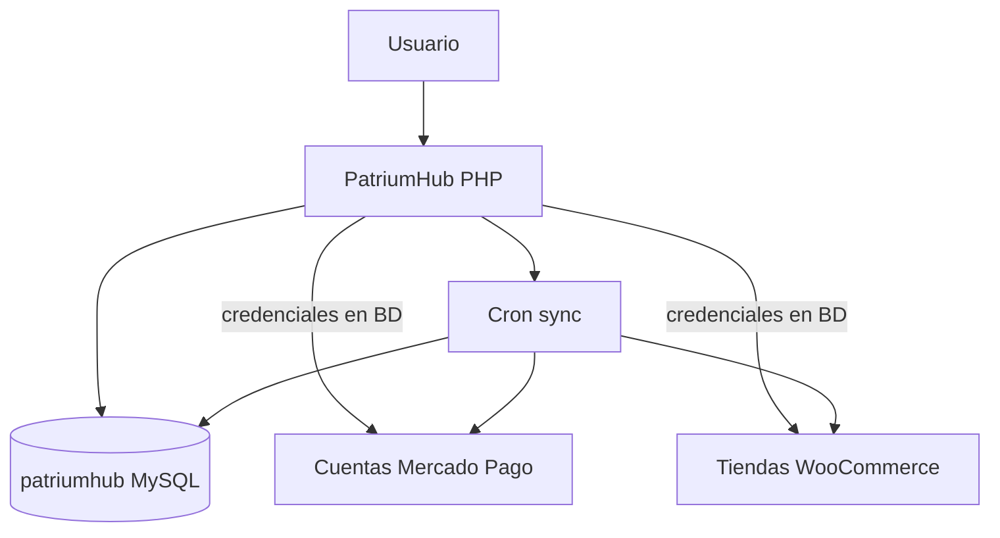

# 01 — Visión general

## Qué es PatriumHub

PatriumHub es un **centro de comando patrimonial** autohosteado. Permite registrar, relacionar, sincronizar y analizar todo lo que una persona o una empresa posee, debe, cobra, administra o controla.

No es un sistema contable, un ERP ni una app de presupuesto. Su misión es responder, con información actualizada y filtrable:

- ¿Cuánto vale mi patrimonio?
- ¿Dónde está?
- ¿Cuánto es líquido?
- ¿Qué parte corresponde a cada empresa?
- ¿Cuánto me deben / cuánto debo?
- ¿Cómo evolucionó y qué explica los cambios?

## Principios de arquitectura

1. **Aplicación monolítica modular**  
   Un solo codebase PHP (front + back) en `PatriumHub/`, organizado por módulos de dominio.

2. **Una sola fuente de verdad**  
   Una base MySQL/MariaDB (`patriumhub`). Cada cuenta, activo, deuda o inventario se registra una sola vez y se asocia a su entidad propietaria.

3. **Patrimonio, no contabilidad**  
   Calcula y explica valor patrimonial. No exige asientos, plan de cuentas, IVA ni conciliaciones formales.

4. **Contexto por entidad**  
   La misma información se ve consolidada o filtrada por persona, empresa, cuenta, moneda, período y etiqueta.

5. **Dashboards fijos + filtros potentes**  
   Los dashboards los define el producto. La flexibilidad está en los filtros, no en un constructor libre.

6. **Integraciones optativas y configurables en UI**  
   WooCommerce y Mercado Pago se conectan desde pantallas del sistema. La carga manual siempre debe ser posible.

7. **Sin duplicación**  
   El motor no suma una empresa y, a la vez, sus activos internos como valores independientes en el patrimonio personal.

8. **Trazabilidad**  
   Todo cambio de valor conserva fecha, origen, autor y evidencia.

## Mapa mental

## Objetivos de negocio que la arquitectura debe sostener

- Ver patrimonio consolidado en menos de un minuto.
- Administrar personas y empresas sin mezclar dueños.
- Conectar varias cuentas MP y varias tiendas WC desde la UI.
- Evitar doble conteo (participaciones vs activos internos).
- Mantener cada dato con fecha y origen visibles.
- Seguir siendo comprensible sin conocimientos contables.
