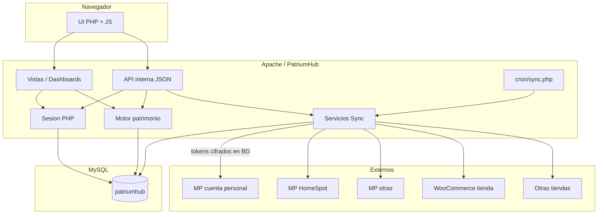
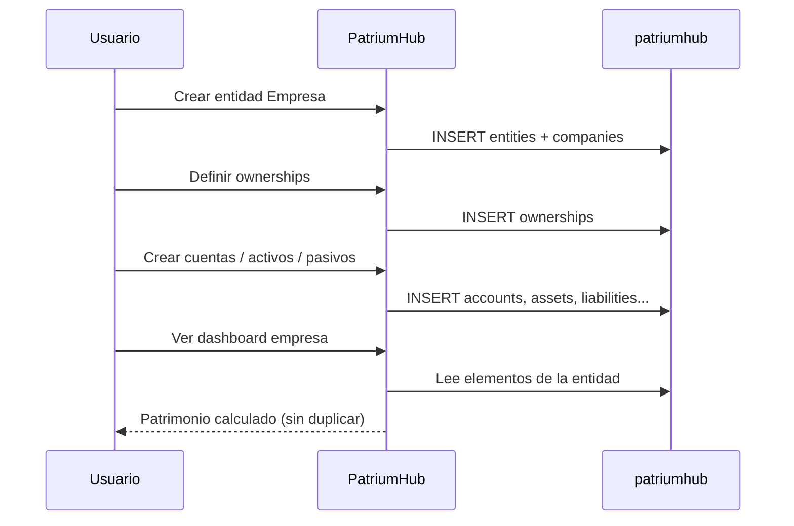
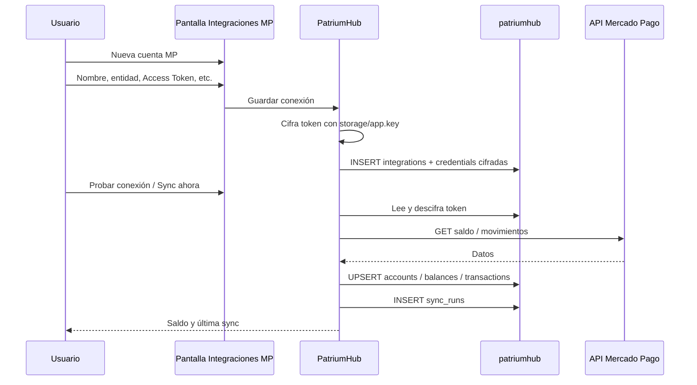
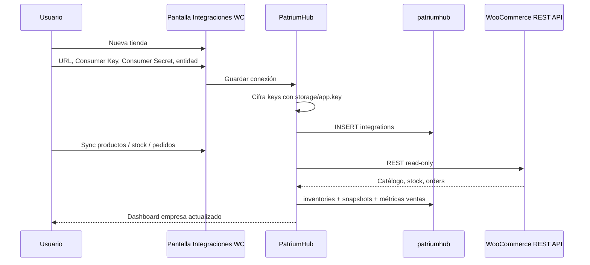
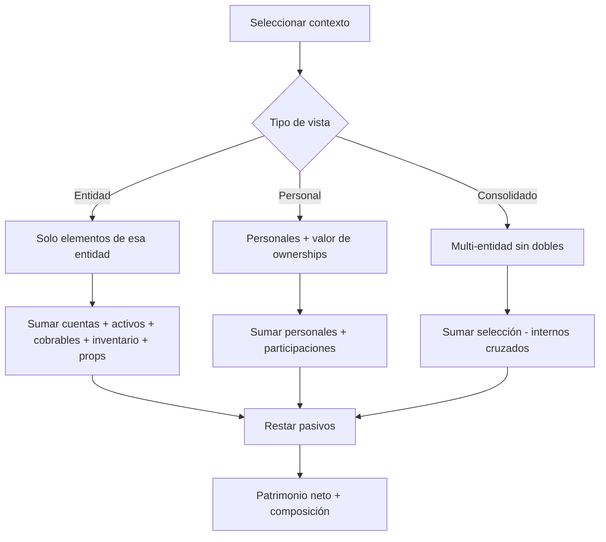

# 03 — Arquitectura de sistema

## Vista de componentes



## Deploy lógico (Apache)

| Componente | Ubicación |
|------------|-----------|
| Carpeta web | `/var/www/html/patrium` (= código de la app) |
| Entry point | `patrium/index.php?r=/ruta` |
| MySQL | import via phpMyAdmin |
| Cron | `php /var/www/html/patrium/cron/sync.php` |

URL: `http://IP/patrium/` — ver [guía de deploy](guia-deploy.md).  
Login seed: `admin@patriumhub.local` / `admin123`.

---

## Flujo A — Alta de empresa y patrimonio base



## Flujo B — Conectar Mercado Pago (sin .env)



## Flujo C — Conectar WooCommerce (sin .env)



## Flujo D — Cálculo de patrimonio



**Fórmula conceptual:**

```
Patrimonio = cuentas + activos + propiedades + cuentas por cobrar
           + inventario + participaciones - pasivos
```

Regla anti-duplicación: en patrimonio personal se suma el valor de la **participación**, no los activos internos de la empresa.

---

## Límites de confianza

| Frontera | Regla |
|----------|-------|
| UI → API interna | Sesión autenticada; CSRF en mutaciones |
| App → MySQL | Un solo usuario de app con grants sobre `patriumhub` |
| App → Mercado Pago | Token por conexión, leído de BD, cifrado en reposo |
| App → WooCommerce | Key/secret por tienda, leídos de BD, cifrados en reposo |
| Integraciones → externos | Solo lectura por defecto |
| Cron → sync | Mismo código de servicios; no bypass de cifrado |

## Procesos programados

| Job | Frecuencia sugerida | Acción |
|-----|---------------------|--------|
| Sync MP | cada 15–60 min | Saldos y movimientos de conexiones activas |
| Sync WC | cada 30–120 min | Stock, productos, pedidos/ventas |
| Snapshots patrimonio | diario | Histórico para evolución |
| Limpieza logs | semanal | Retener sync_runs / audit según política |
