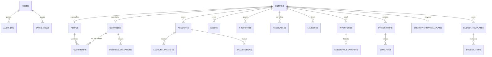

# 04 — Base de datos

## Decisión

**Una sola base de datos** para todo PatriumHub, versionada como un único archivo de instalación:

| Nombre BD | Archivo SQL | Ownership |
|-----------|-------------|-----------|
| `patriumhub` | `databases/patriumhub.sql` | App PatriumHub |

Schema version actual: **0.8.0** (ver `settings.schema.version`).

> Deploy: importar **solo** `databases/patriumhub.sql` en phpMyAdmin.  
> Los patches históricos quedan absorbidos; no hace falta aplicar varios `.sql`.

## Principios

1. **Charset** `utf8mb4` / collation `utf8mb4_unicode_ci`.
2. **Sin secretos en el SQL** (tokens van cifrados en runtime; seed sin credenciales reales).
3. **Soft-delete o estados** donde aporte trazabilidad (cuentas cerradas, deudas canceladas).
4. **Historial temporal** separado del valor actual (`account_balances`, `inventory_snapshots`, `business_valuations`, `net_worth_snapshots`).
5. **Integraciones como entidades de primer nivel** — no hardcode en config de deploy.

## Diagrama ER conceptual



## Entidades actuales

### Identity / núcleo

| Tabla | Uso |
|-------|-----|
| `users` | Login local (`admin` \| `viewer`) |
| `user_entity_access` | Personas/empresas visibles para usuarios no-admin |
| `entities` | Dueño lógico: `type` = `person` \| `company` |
| `people` | Datos específicos de persona |
| `companies` | Datos de empresa + `business_model` (`services` \| `products`) |
| `ownerships` | % participación persona → empresa |

### Wealth

| Tabla | Uso |
|-------|-----|
| `accounts` | Bancos, billeteras, efectivo, MP, brokers |
| `account_balances` | Historial de saldos |
| `assets` | Activos generales (pueden vincularse a cuenta) |
| `properties` | Inmuebles |
| `receivables` | Dinero a cobrar |
| `liabilities` | Pasivos / obligaciones |
| `currencies` | Catálogo ARS/USD/EUR |
| `tags` / `entity_tags` | Etiquetas opcionales (reservado) |

### Presupuestos y proyección

| Tabla | Uso |
|-------|-----|
| `budget_templates` | Gasto fijo recurrente (mensual) |
| `budget_items` | Instancia del mes (`pending` / `paid` / `skipped`) |
| `company_financial_plans` | Estados y proyección por empresa (`workbook_json` v2) |

### Business / inventario

| Tabla | Uso |
|-------|-----|
| `inventories` | Resumen de stock por entidad/fuente |
| `inventory_snapshots` | Historial valor/unidades |
| `business_valuations` | Valuación de empresa + método |
| `sales_metrics` | Agregados WC por período |

### Movimientos

| Tabla | Uso |
|-------|-----|
| `transactions` | Ingresos, egresos, transferencias, ajustes |
| `transaction_categories` | Categorías (Sueldos, Honorarios, WC, etc.) |

### Integraciones

| Tabla | Uso |
|-------|-----|
| `integrations` | Conexión: provider, entity_id, nombre, estado |
| `integration_credentials` | Keys/tokens **cifrados** |
| `sync_runs` | Ejecuciones, OK/error, conteos |
| `sync_cursors` | Paginación / last_id / last_date |

### Historial y soporte

| Tabla | Uso |
|-------|-----|
| `net_worth_snapshots` | Snapshots personal / consolidado / entidad |
| `saved_views` | Filtros de dashboard guardados |
| `documents` | Adjuntos (reservado) |
| `audit_log` | Quién cambió qué |
| `settings` | Preferencias de app |

## `company_financial_plans` (Estados y proyección)

| Campo | Nota |
|-------|------|
| `entity_id` | FK única a empresa |
| `workbook_json` | Libro v2 + `template` `services`\|`products` |
| Servicios | `clients[]` × mes + `expenses[]` |
| Productos | `income_months[12]` + `expenses[]` (sin clientes) |
| Creación | Al alta según `companies.business_model` |
| Seed Soup IT | Solo servicios; Excel en `storage/templates/` |

## Repo `databases/`

```
databases/
├── README.md
├── patriumhub.sql                 # único SQL de instalación
├── patch_estados_proyeccion.sql   # histórico (absorbido en 0.7.0)
├── build_install_sql.py           # regenera install limpio desde dump
└── archives/                      # dumps phpMyAdmin con datos (no instalar)
```

## Qué no vive en esta BD

- Tokens en texto plano.
- Credenciales hardcodeadas de MP/WC.
- Segunda BD por módulo.
