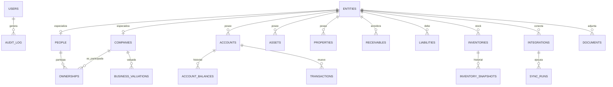

# 04 — Base de datos

## Decisión

**Una sola base de datos** para todo PatriumHub, versionada como archivo `.sql` en el repo `databases/`:

| Nombre BD | Archivo SQL | Ownership |
|-----------|-------------|-----------|
| `patriumhub` | `databases/patriumhub.sql` | App PatriumHub |

> Los schemas viven únicamente en `databases/*.sql`.  
> Deploy: importar en phpMyAdmin.  
> Por ahora no hay segunda BD ni microservicios de datos.

## Principios

1. **Charset** `utf8mb4` / collation `utf8mb4_unicode_ci`.
2. **Sin secretos en el SQL** (tokens van cifrados en runtime; seeds demo sin credenciales reales).
3. **Soft-delete o estados** donde aporte trazabilidad (cuentas cerradas, deudas canceladas).
4. **Historial temporal** separado del valor actual (`account_balances`, `inventory_snapshots`, `business_valuations`).
5. **Integraciones como entidades de primer nivel** — no hardcode en config de deploy.

## Diagrama ER conceptual



## Entidades objetivo

### Identity / núcleo

| Tabla | Uso |
|-------|-----|
| `users` | Login local (admin del sistema) |
| `entities` | Dueño lógico: `type` = `person` \| `company` |
| `people` | Datos específicos de persona |
| `companies` | Datos específicos de empresa |
| `ownerships` | % participación persona → empresa |
| `roles` / `permissions` (mínimo) | Roles simples MVP |

### Wealth

| Tabla | Uso |
|-------|-----|
| `accounts` | Bancos, billeteras, efectivo, MP, brokers |
| `account_balances` | Historial de saldos |
| `assets` | Activos generales |
| `properties` | Inmuebles y detalle especializado |
| `receivables` | Dinero a cobrar |
| `liabilities` | Pasivos / obligaciones |
| `currencies` | Catálogo ARS/USD/EUR… |
| `tags` / `entity_tags` | Etiquetas opcionales |

### Business / inventario

| Tabla | Uso |
|-------|-----|
| `inventories` | Resumen de stock por entidad/fuente |
| `inventory_snapshots` | Historial valor/unidades |
| `business_valuations` | Valuación de empresa + método |
| `sales_metrics` (opcional) | Agregados WC por período |

### Movimientos

| Tabla | Uso |
|-------|-----|
| `transactions` | Ingresos, egresos, transferencias, ajustes |
| `transaction_categories` | Categorías |

### Integraciones (crítico)

| Tabla | Uso |
|-------|-----|
| `integrations` | Conexión: provider, entity_id, nombre, estado |
| `integration_credentials` | Keys/tokens **cifrados**, scopes, metadata |
| `sync_runs` | Ejecuciones, OK/error, conteos, timestamps |
| `sync_cursors` | Paginación / last_id / last_date |

Campos clave de `integrations`:

| Campo | Ejemplo |
|-------|---------|
| `provider` | `mercadopago` \| `woocommerce` |
| `entity_id` | FK a `entities` |
| `name` | `MP HomeSpot` |
| `status` | `active` \| `error` \| `revoked` |
| `config_json` | URL tienda, moneda, flags de sync |
| `last_sync_at` | Actualidad |
| `include_in_net_worth` | Si aplica vía cuenta vinculada |

Campos clave de `integration_credentials`:

| Campo | Nota |
|-------|------|
| `integration_id` | FK |
| `key_name` | `access_token`, `consumer_key`, `consumer_secret`… |
| `value_encrypted` | ciphertext |
| `updated_at` | rotación |

### Soporte

| Tabla | Uso |
|-------|-----|
| `documents` | Adjuntos / referencias |
| `audit_log` | Quién cambió qué |
| `settings` | Preferencias de app (tema, ocultar cifras, etc.) |

## Qué no vive en esta BD (aún)

- Segunda BD por módulo.
- Data warehouse separado.
- Tokens en texto plano.
- Credenciales hardcodeadas de MP/WC.

## Repo `databases/`

```
databases/
├── README.md
├── patriumhub.sql          # schema completo
└── seeds/
    └── demo_minimo.sql     # opcional, sin secretos reales
```

Cada archivo debe ser:
- aplicable en phpMyAdmin de una sola vez (o con instrucciones claras),
- con `utf8mb4`,
- sin datos secretos,
- con índices para filtros de dashboard (`entity_id`, fechas, provider).
