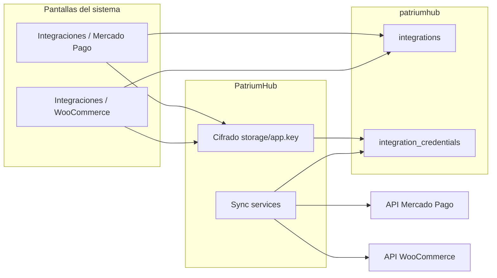
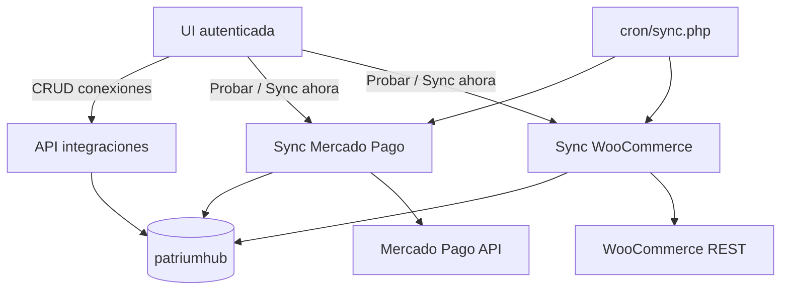
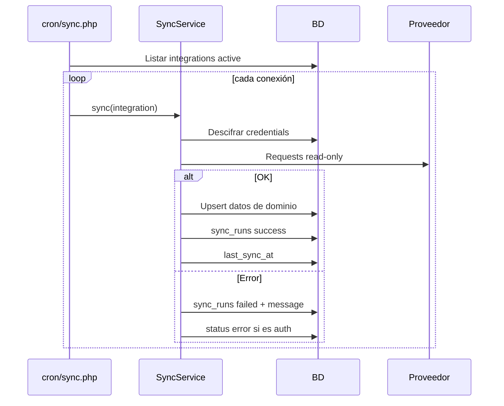

# 05 — Integraciones

## Principio rector

Las credenciales de **Mercado Pago** y **WooCommerce** **no van en `.env`**.

Cada cuenta / tienda se carga desde el menú **Integraciones**, se asocia a una **entidad**, y se guarda **cifrada en la BD**.

- `.env` → solo MySQL + URL de la app  
- Clave de cifrado → se genera en **Configuración** (`storage/app.key`)  
- Tokens WC/MP → solo pantallas de Integraciones

---

## Mapa de contratos

---

## 1. Mercado Pago — múltiples cuentas

### Objetivo
Conectar N cuentas (personal, HomeSpot, Soup IT, etc.), cada una ligada a una entidad.

### Pantalla: Integraciones → Mercado Pago

Campos por conexión:

| Campo UI | Persistencia |
|----------|--------------|
| Nombre | `integrations.name` |
| Entidad propietaria | `integrations.entity_id` |
| Access Token | `integration_credentials` cifrado |
| Public Key (si aplica) | cifrado / opcional |
| Modo | `test` / `prod` en `config_json` |
| Sync automático | flag |
| Recursos a importar | saldos, movimientos, comisiones… |
| Incluir en liquidez | vía cuenta vinculada |

Acciones UI:
- Guardar
- Probar conexión
- Sincronizar ahora
- Revocar / desactivar
- Ver última sync y errores

### Datos importados

| Dato | Uso en PatriumHub |
|------|-------------------|
| Saldo disponible | Liquidez por cuenta/entidad |
| Retenido / pendiente | Separar no disponible |
| Ingresos / egresos | Movimientos del período |
| Transferencias | Flujos a bancos / otras cuentas |
| Comisiones | Costo de operar |
| Devoluciones | Ajustes |
| Fecha sync | Actualidad |

### Reglas
- Cada MP → una `integration` + una `account` tipo billetera (o link a cuenta existente).
- Movimientos importados nacen con `origin = integration`.
- En dashboard general se consolidan; en dashboard empresa solo las de esa entidad.
- Revocar una conexión no borra histórico de movimientos (marca `revoked` y deja de sync).

---

## 2. WooCommerce — múltiples tiendas

### Objetivo
Conectar N tiendas, cada una a una entidad (ej. HomeSpot).

### Pantalla: Integraciones → WooCommerce

| Campo UI | Persistencia |
|----------|--------------|
| Nombre | `integrations.name` |
| Entidad | `integrations.entity_id` |
| URL de la tienda | `config_json.store_url` |
| Consumer Key | cifrado |
| Consumer Secret | cifrado |
| Versión API | `config_json.api_version` (ej. `wc/v3`) |
| Sync automático / frecuencia | flags |
| Recursos | productos, stock, pedidos, clientes, ventas |

Acciones UI: mismas que MP (guardar, probar, sync, revocar).

### Datos importados

| Dato | Uso |
|------|-----|
| Productos / variaciones | Catálogo y conteos |
| Stock | Unidades + valor de stock informado |
| Pedidos | Cantidad, estados, evolución |
| Ventas | Totales por período |
| Devoluciones | Alertas operativas |
| Clientes | Cantidad / recurrencia (agregado) |

### Reglas
- **Solo lectura por defecto.**
- El valor de inventario lo define el dato de WC o el override manual del usuario; PatriumHub no impone criterio contable.
- Fallos de auth se ven en la ficha de integración (`status = error` + mensaje en `sync_runs`).

---

## 3. Sync engine

| Escenario | Comportamiento |
|-----------|----------------|
| Token inválido | `status=error`, alerta en UI, no borrar datos previos |
| API caída | reintento en próximo cron; log en `sync_runs` |
| Sync manual | misma pipeline que cron |
| Conexión revocada | excluida del cron |
| Sin storage/app.key | sync falla; hay que generar clave en Configuración |

---

## 4. Integraciones futuras (fuera de MVP)

Bancos/CSV, Mercado Libre, PayPal/Wise, cripto, brokers, valuaciones externas, paperless-ngx, API pública de PatriumHub.

Mismo patrón: **pantalla de conexión + credentials cifradas + sync_runs**.

---

## 5. Qué SÍ puede vivir en config local

| Clave | Uso |
|-------|-----|
| `DB_HOST` / `DB_USER` / `DB_PASS` / `DB_NAME` | Conexión MySQL |
| `APP_URL` | Links absolutos |
| `SESSION_*` | Cookies / seguridad sesión |
| `storage/app.key` | Clave de cifrado (generada en Configuración) |

**Nunca en `.env`:** Access Token MP, Public Key MP, Consumer Key/Secret WC.

---

## Ver también

- Deploy Apache: [11 — Guía de deploy](guia-deploy.md)
