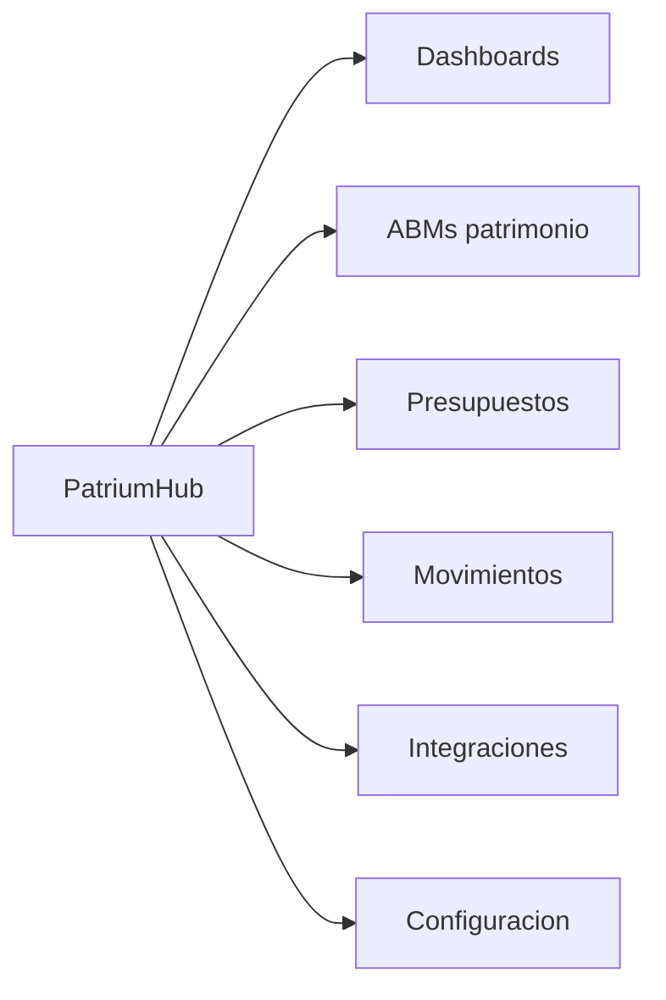

# 06 — UI / UX

## Una experiencia, un trabajo claro

PatriumHub es una sola app. La UI prioriza **comprensión patrimonial** sobre densidad de un ERP.

Tema visual: fondo carbón, acento ámbar, tipografía display + sans.

---

## Navegación principal

Barra superior (desktop) / panel hamburger (móvil):

1. **Inicio** — resumen rápido  
2. **Dashboard** — gráficos, snapshots, vistas guardadas  
3. **Patrimonio** ▾ — Personas, Empresas, Participaciones, Cuentas, Activos varios, Propiedades, Cobrables, Pasivos, Inventario  
4. **Presupuestos**  
5. **Movimientos**  
6. **Perfil** ▾ — Configuración (perfil / usuarios / sistema), Integraciones, Salir  
7. Toggle **Ocultar cifras**

Configuración: cambiar nombre/email/contraseña; admin crea usuarios y tilda personas/empresas visibles.

> Mercado Pago no tiene ítem de menú propio: vive en **Cuentas** (tipo MP) y en el dashboard de empresa / analytics.

---

## Dashboards

Filtros globales (moneda, entidad, fechas, origen) + chips activos + **vistas guardadas**.

### Dashboard general

| Panel | Tipo |
|-------|------|
| KPIs | Patrimonio neto, activos, pasivos, liquidez |
| Composición | Cuentas, activos, propiedades, cobrables, inventario, participaciones |
| Por entidad | Barras / participación |
| Evolución | Snapshots (neto, activos, pasivos) |
| Flujo | Ingresos vs egresos del período |
| Complemento | Últimos movimientos, capturar snapshot |

### Ficha empresa — pestañas

`Resumen · Cuentas · [Clientes] · Estados y proyección · Activos varios · Pasivos · Propiedades · Inventario · Cobrables · Movimientos · Integraciones · Participaciones · Valuación`

**Clientes** (solo `business_model = services`): listado sync desde proyección, KPIs activo/inactivo, ficha con contacto, contrato PDF y docs extra.

**Estados y proyección:** dashboard de KPIs + tablas HTML.  
- Servicios: clientes × mes + costos.  
- Productos: ingresos totales por mes + costos.  
Un libro por empresa; hojas por año. El tipo de negocio se elige **solo al crear** la empresa.

### Ficha persona — pestañas

`Resumen · Cuentas · Activos · Pasivos · Propiedades · Cobrables · Movimientos · Participaciones`

### Cuentas

Listado con saldos, gráficos de composición, alta/edición/borrado (saldo 0). Incluye cuentas Mercado Pago sincronizadas.

---

## Flujos UX críticos

### Alta de empresa
1. Crear empresa eligiendo tipo servicios/productos (se crea plan de Estados y proyección; Soup IT puede seedearse).  
2. Definir ownerships.  
3. Crear cuentas o conectar integraciones.  
4. Cargar activos / pasivos / cobrables.  
5. Completar **Estados y proyección** si aplica.  
6. En servicios: completar fichas en **Clientes** (contacto, contrato, docs).  
7. Revisar resumen / valuación.

### Alta de cuenta
Desde Cuentas (elige entidad) o desde ficha de empresa.

### Conectar integración
Perfil → Integraciones → proveedor → entidad + credenciales → probar → sync.

### Presupuesto del mes
Presupuestos → asegurar período → pagar / omitir / revertir. Los `pending` suman a pasivos.

### Dinero prestado
Alta como cobrable → pagos parciales hasta cancelar.

---

## Estados de interfaz

| Estado | Tratamiento |
|--------|-------------|
| Vacío | Empty state con CTA |
| Carga | Skeleton en KPIs/tablas densas |
| Error sync | Badge / mensaje en integraciones |
| Privacidad | Clase `hide-amounts` en body |
