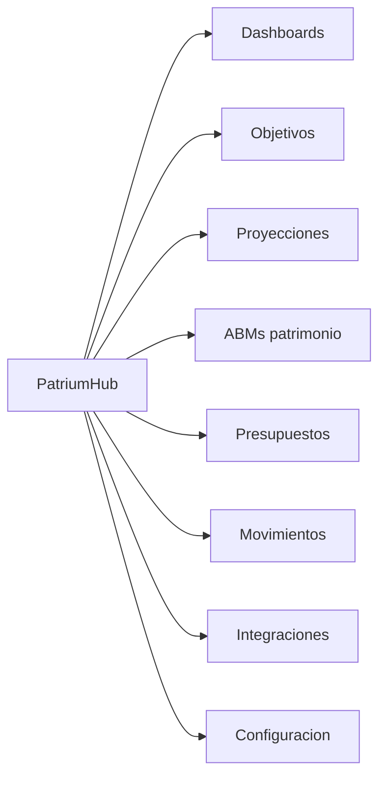

# 06 — UI / UX

## Una experiencia, un trabajo claro

PatriumHub es una sola app. La UI prioriza **comprensión patrimonial** sobre densidad de un ERP.

Tema visual: fondo claro (`#f4f6f8`), acento verde, tipografía **DM Sans** + **IBM Plex Mono** (cifras).

---

## Navegación principal

Barra superior (desktop) / panel hamburger (móvil):

1. **Inicio** — resumen rápido (+ fila % sobre activos)  
2. **Dashboard** — gráficos, snapshots, vistas guardadas (+ fila % sobre activos)  
3. **Objetivos** — Objetivos fundamentales (milestones + metas; alta en `/objetivos/nuevo`)  
4. **Proyecciones** — flujo, ahorro, carga de egresos y gasto diario (solo lectura)  
5. **Patrimonio** ▾ — Personas, Empresas, Participaciones, Cuentas, Activos varios, Propiedades, Cobrables, Pasivos, Inventario  
6. **Presupuestos**  
7. **Movimientos**  
8. **Perfil** ▾ — Configuración (perfil / usuarios / sistema), Integraciones, Salir  
9. Toggle **Ocultar cifras**

Configuración: cambiar nombre/email/contraseña; admin crea usuarios y tilda personas/empresas visibles.

> Mercado Pago no tiene ítem de menú propio: vive en **Cuentas** (tipo MP) y en el dashboard de empresa / analytics.

---

## Dashboards

Filtros globales (moneda, entidad, fechas, origen) + chips activos + **vistas guardadas**.

### Dashboard general

| Panel | Tipo |
|-------|------|
| KPIs | Patrimonio neto, activos, pasivos, liquidez |
| % sobre activos | Segunda fila: qué % de los activos totales es cada KPI de arriba |
| Composición | Cuentas, activos, propiedades, cobrables, inventario, participaciones |
| Por entidad | Barras / participación |
| Evolución | Snapshots (neto, activos, pasivos) |
| Flujo | Ingresos vs egresos del período |
| Complemento | Últimos movimientos, capturar snapshot |

### Objetivos (menú)

Ruta `GET /objetivos` · alta `GET/POST /objetivos/nuevo` · progreso/eliminar por id · POST fondo / ahorro-15.

1. **Milestones** (cards full-width + **Cumplidos N/N**):
   - 01 fondo emergencia ARS 1.2M (juntado manual en `settings`)
   - 02 deudas = pasivos abiertos de entidades `person`
   - 03 meta auto = 15% ingreso neto personas del año en curso; ahorrado manual `goals.ramsey.ms03_saved_{año}_{moneda}`
2. Corte visual.
3. **Tus objetivos** (Cumplidos N/N + Agregar): listado `financial_goals`; formulario solo en `/objetivos/nuevo`.

### Proyecciones (menú)

Orden de bloques:

1. KPIs de flujo (incluye **promedio mensual** = disponible neto anual ÷ 12) y tiles de realidad  
2. **Flujo del año** (gráfico ancho ingresos/egresos/balance; sin doughnut de composición) + personas vs empresas + por entidad  
3. **Ahorro proyectado**  
4. Tablas Personas / Empresas  
5. **Carga de egresos** al final:
   - Consolidado: anillo egresos + ahorro + disponible neto; mes a mes apilado; por entidad horizontal; personas vs empresas  
   - Persona (ficha): lo mismo a nivel individual + **por categoría** (nombre de cada línea de egreso × % del ingreso)  
6. **Gasto diario máximo**: 12 cards = disponible neto **del mes** (tras ahorro) ÷ días de ese mes; línea de referencia = promedio mensual ÷ 30; gráfico mes a mes.

Filtros: año, alcance, moneda. Paleta unificada verde/coral. La carga de egresos usa egresos de planilla ÷ ingresos (no `budget_templates`). El verde del bloque es **disponible neto** (balance − ahorro), no el balance bruto. Partial de KPIs %: `app/Views/partials/stat_pct_of_assets.php` (Inicio + Dashboard).

### Ficha empresa — pestañas

`Resumen · Cuentas · [Clientes] · Estados y proyección · Activos varios · Pasivos · Propiedades · Inventario · Cobrables · Movimientos · Integraciones · Participaciones · Valuación`

**Clientes** (solo `business_model = services`): listado sync desde proyección, KPIs activo/inactivo, ficha con contacto, contrato PDF y docs extra.

**Estados y proyección:** dashboard (Comparativa por año + Detalle del año) + tablas HTML +, al final, **carga de egresos** (egresos + ahorro + disponible neto; por nombre de costo) y **gasto diario máximo** (neto tras ahorro ÷ días; ref. ÷ 30).  
- Año activo: por defecto el **año calendario**; el select de Comparativa y las pills de Detalle comparten el mismo índice.  
- **+ Año** agrega el siguiente año numérico (sin prompt); doble clic en la pill para renombrar.  
- Servicios: clientes × mes + costos.  
- Productos: ingresos totales por mes + costos.  
Un libro por empresa; hojas por año. El tipo de negocio se elige **solo al crear** la empresa.

### Ficha persona — pestañas

`Resumen · Proyecciones · Cuentas · Activos · Pasivos · Propiedades · Cobrables · Movimientos · Participaciones`

**Proyecciones:** tablero con neto real, KPIs del año, **promedio mensual** (disponible neto ÷ 12), **flujo del año** a ancho completo, planilla editable y, al final, **carga de egresos** (egresos + ahorro + disponible neto; por nombre de egreso) + **gasto diario máximo** (neto tras ahorro ÷ días; ref. ÷ 30). Año activo por defecto = calendario. Sin gráfico de “composición”.

### Listados de patrimonio

Cada listado (cuentas, activos, propiedades, cobrables, pasivos, inventario, personas, empresas, participaciones) muestra **métricas** arriba y, cuando aplica, gráficos por tipo / entidad + filtro de moneda. **Cobrables:** cabeceras ordenables; en ficha persona/empresa también columna **Vence**; alta/cobro desde ficha vuelve a la entidad (`return_to`).

### Cuentas

Listado con saldos, gráficos de composición, alta/edición/borrado (saldo 0). Incluye cuentas Mercado Pago sincronizadas.

---

## Flujos UX críticos

### Alta de empresa
1. Crear empresa eligiendo tipo servicios/productos (se crea plan de Estados y proyección; Soup IT puede seedearse).  
2. Definir ownerships.  
3. Crear cuentas o conectar integraciones.  
4. Cargar activos / pasivos / cobrables.  
5. Completar **Estados y proyección** si aplica.  
6. En servicios: completar fichas en **Clientes** (contacto, contrato, docs).  
7. Revisar resumen / valuación / menú Proyecciones.

### Alta de cuenta
Desde Cuentas: titularidad persona(s) con % o empresa; saldo; tipo. Las cuentas personales pueden compartirse entre varias personas.

### Conectar integración
Perfil → Integraciones → proveedor → entidad + credenciales → probar → sync.

### Presupuesto del mes
Presupuestos → asegurar período → pagar / omitir / revertir.  
Solo los `pending` con `period_ym` ≤ mes actual suman a pasivos. Navegar un mes futuro no baja el neto.  
**Gastos agrupados:** por entidad, con composición (% por nombre) y ranking de mayor a menor.

### Dinero prestado
Alta como cobrable → marcar pago (acredita en cuenta) hasta cancelar.  
Desde ficha persona/empresa: al guardar o cobrar volvés a esa pestaña **Cobrables**.

---

## Estados de interfaz

| Estado | Tratamiento |
|--------|-------------|
| Vacío | Empty state con CTA |
| Carga | Skeleton en KPIs/tablas densas |
| Error sync | Badge / mensaje en integraciones |
| Privacidad | Clase `hide-amounts` en body |
