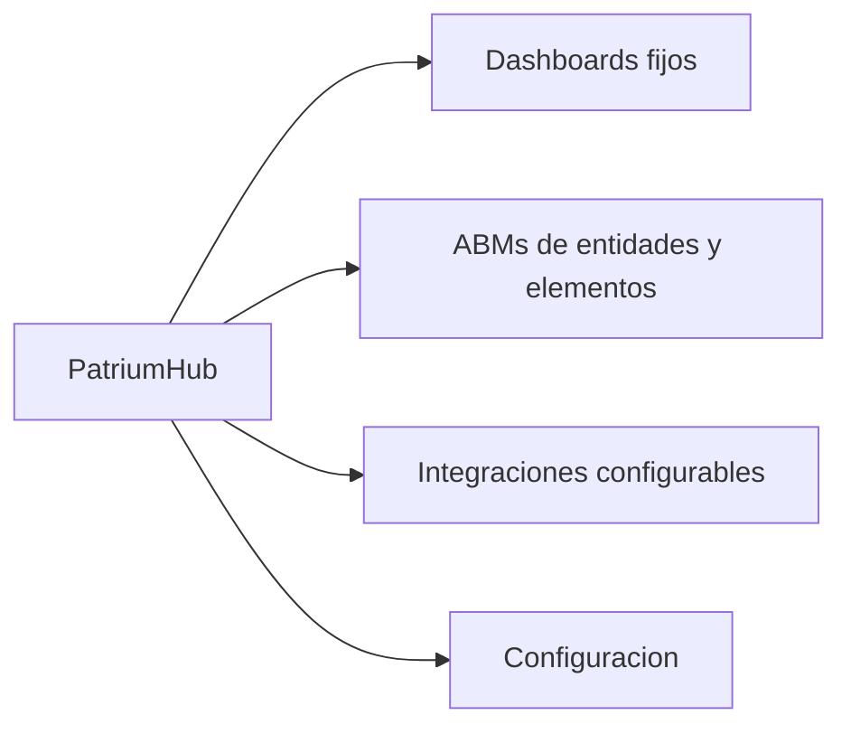

# 06 — UI / UX

## Una experiencia, un trabajo claro

PatriumHub es una sola app. La UI debe priorizar **comprensión patrimonial** sobre densidad operativa de un ERP.

---

## Navegación principal

Barra corta (no un link por ABM):

1. Inicio  
2. Dashboard  
3. Mercado Pago  
4. **Patrimonio** (menú: Personas, Empresas, Participaciones, Cuentas, Activos, Propiedades, Cobrables, Pasivos, Inventario, Movimientos)  
5. Integraciones  
6. Configuración  

Footer: solo el nombre del producto (sin fases ni versión de roadmap).

---

## Dashboards fijos

No hay constructor libre. La personalización vive en **filtros globales**:

- Entidad / conjunto de entidades  
- Persona / empresa  
- Cuenta / proveedor  
- Moneda  
- Tipo de activo / pasivo  
- Categoría / etiqueta  
- País  
- Rango de fechas  
- Origen: manual | integración  
- Estado: activo, cerrado, vencido, pendiente  

Los filtros actualizan paneles sin recarga completa, muestran chips de selección activa y permiten guardar vistas frecuentes (fase posterior).

### Dashboard general
Vista **principalmente gráfica** (Anexo A / producto):

| Panel | Tipo |
|-------|------|
| KPIs | Patrimonio neto, activos, pasivos, liquidez |
| Composición de activos | Gráfico (cuentas, activos, propiedades, cobrables, inventario, participaciones) |
| Distribución por entidad | Gráfico de barras / participación |
| Evolución patrimonial | Serie temporal (snapshots: neto, activos, pasivos) |
| Flujo del período | Ingresos vs egresos |
| Complemento | Filtros, vistas guardadas, últimos movimientos |

No es un listado denso tipo ERP: primero se entiende con gráficos; el detalle tabular es secundario.

### Dashboard por empresa
Todo pre-filtrado: patrimonio, caja/bancos, saldos MP, activos/pasivos, cobrables, stock, ventas/pedidos WC, ingresos/egresos, evolución, alertas.

Ficha empresa — pestañas:
`Resumen · Cuentas · Activos · Pasivos · Propiedades · Inventario · Cobrables · Movimientos · Integraciones · Dashboard · Configuración`

### Dashboard Mercado Pago
Saldo consolidado y por cuenta, ingresos/gastos/comisiones, transferencias, comparación entre cuentas, evolución, últimos movimientos, alertas de conexión.

---

## Flujos UX críticos

### Alta de empresa
1. Crear empresa  
2. Definir ownerships  
3. Crear cuentas o conectar integraciones  
4. Cargar activos / pasivos / cobrables  
5. Conectar WC / MP si aplica  
6. Revisar dashboard de la empresa  

### Alta de cuenta
Desde Cuentas (elige entidad) o desde ficha de empresa (entidad preseleccionada).

### Conectar integración
Integraciones → proveedor → nueva conexión → entidad + credenciales → probar → sync → ver resultado en dashboard.

### Dinero prestado
Alta como receivable → aparece en patrimonio → pagos parciales hasta cancelar.

### Propiedad compartida
% propiedad + valuaciones históricas + hipoteca asociada → valor neto atribuible.

---

## Estados de interfaz

| Estado | Tratamiento |
|--------|-------------|
| Vacío | CTA clara (“Creá tu primera empresa”) |
| Cargando | Skeleton loaders en dashboards |
| Error de sync | Badge en integración + detalle en sync_runs |
| Dato desactualizado | Fecha de origen visible |
| Cifras sensibles | Toggle ocultar montos (configuración) |

## Motion
Conteos progresivos, gráficos al cargar, transiciones al filtrar. Sin animaciones decorativas.

## Dirección visual
Seguir mockups del documento de diseño (Anexo A). Priorizar jerarquía, orden y consistencia; evitar look de ERP genérico.
