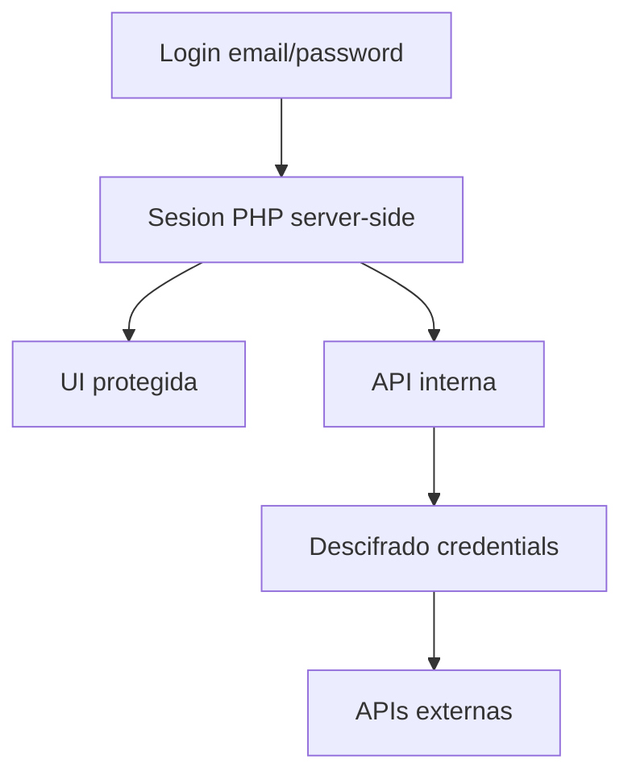

# 07 — Seguridad y autenticación

## Modelo de auth (MVP)

- Autenticación por **sesión PHP** contra `users`.
- MFA: previsto a futuro, no bloqueante del MVP.
- Roles mínimos: `admin` (todo) y, si hace falta, `viewer` (solo lectura).
- Permisos por entidad: roadmap (compartir acceso familiar); MVP asume un operador principal.

## Credenciales de integraciones

| Regla | Detalle |
|-------|---------|
| Almacenamiento | Solo en BD, columna cifrada |
| Algoritmo | AES-256-GCM (o equivalente) con `APP_KEY` |
| Visualización | La UI **no** re-muestra el token completo tras guardar; solo “••••” + rotar |
| Revocación | Independiente por conexión |
| Alcance | Mostrar scopes / permisos conocidos |
| Tránsito | HTTPS obligatorio en producción |
| Logs | Nunca loguear tokens en claro |

## Controles de aplicación

- CSRF en formularios y mutaciones JSON.
- Password hashing (`password_hash` / Argon2id o bcrypt).
- Rate limit básico en login.
- Prepared statements en todo SQL.
- Uploads validados (tipo/tamaño) en `documents`.
- Separar DocumentRoot: solo `public/` expuesto.

## Auditoría y privacidad

- `audit_log` para altas, bajas, ediciones sensibles y cambios de integraciones.
- Cada sync deja rastro en `sync_runs`.
- Posibilidad de ocultar cifras en pantalla.
- Exportación y borrado completo de datos (criterio de producto).
- Backups de MySQL fuera del DocumentRoot.

## Secretos: mapa final

| Secreto | Dónde | En git |
|---------|-------|--------|
| DB credentials | config local / `.env` infra | No |
| `APP_KEY` | config local | No |
| Tokens MP (N cuentas) | BD cifrada vía UI | No |
| Keys WooCommerce (N tiendas) | BD cifrada vía UI | No |
| Schema SQL | `databases/patriumhub.sql` | Sí |
| Seeds demo | sin secretos reales | Sí |

## Superficie pública

| Endpoint | Auth |
|----------|------|
| `/login` | Público |
| Resto de UI/API | Sesión |
| Webhooks futuros | Firma/secret por integración (si se habilitan) |
| Cron CLI | Solo ejecución local/servidor, no HTTP público |
