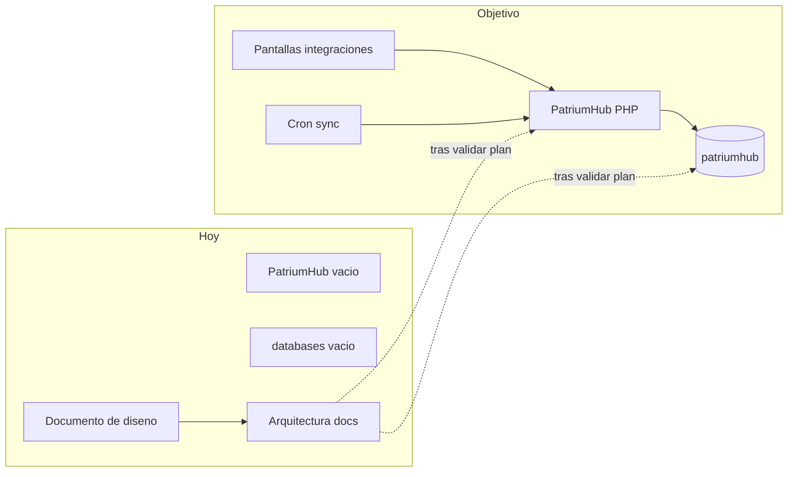

# 08 — Estado actual vs objetivo

## Resumen ejecutivo

Hoy existen los **repos vacíos** (`PatriumHub/`, `databases/`, `Arquitectura/`) y el **documento de diseño de producto** (v1).  
El objetivo es una app PHP monolítica + una BD MySQL desplegable en Apache/phpMyAdmin, con integraciones configurables desde pantallas.

| Tema | Hoy (post Fase 5) | Objetivo |
|------|-------------------|----------|
| Código app | MVP completo (Fases 0–5) | Operación diaria + integraciones reales |
| BD | Schema 0.5.0 + seed demo opcional | Backups periódicos |
| Docs arquitectura | Set completo + HTTPS/backup | Mantener vivo |
| Deploy | [Guía de deploy](guia-deploy.md) + implementación local | App en HTTPS |
| Mercado Pago | Multi-cuenta desde UI | Probar con cuentas reales |
| WooCommerce | Pantallas + sync stock/ventas | Probar con tienda real |
| `.env` para MP/WC | Solo `DB_*` + `APP_URL`; tokens en menú | Mantener así |
| Patrimonio | Modos personal / consolidado / entidad | Uso diario sin dobles |
| UX / privacidad | Skeleton, chips, ocultar cifras, CSV | Feedback de uso real |

## Diagrama gap

## Prioridad técnica

1. Congelar docs de `Arquitectura/` ✅
2. Schema `databases/patriumhub.sql` ✅
3. Bootstrap PHP Apache ✅
4. MVP patrimonio manual (Fase 1) ✅
5. Pantallas de integraciones + cifrado ✅
6. Sync WooCommerce ✅
7. Sync multi Mercado Pago ✅
8. Participaciones / anti-duplicación / historial ✅
9. Pulido UX / seguridad / operación ✅
10. Uso real + integraciones productivas ← siguiente
