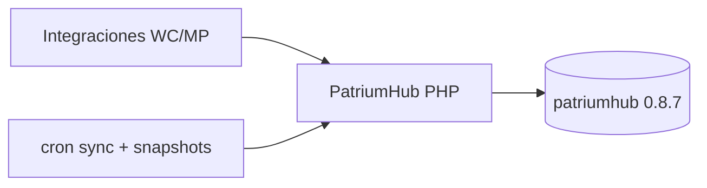

# 08 — Estado actual vs objetivo

## Resumen ejecutivo

PatriumHub está **operativo** (MVP Fases 0–5 + módulos post-MVP).  
Stack: app PHP monolítica + BD MySQL (`patriumhub.sql` **0.8.7**) en Apache/phpMyAdmin, con integraciones WC/MP desde pantallas.

| Tema | Hoy | Siguiente |
|------|-----|-----------|
| Código app | MVP + presupuestos, proyecciones, objetivos, clientes, cuentas/activos compartidos, métricas | Uso diario + pulido |
| BD | Schema **0.8.7** instalable en un solo SQL | Backups periódicos |
| Docs | Arquitectura + Guía de uso v2.3 | Mantener vivo |
| Deploy | Carpeta `/patrium`, rutas `index.php?r=/...` | HTTPS en producción |
| Mercado Pago | Multi-cuenta desde UI → Cuentas | Mantener sync estable |
| WooCommerce | Sync stock/ventas desde Integraciones | Tienda(s) productivas |
| Patrimonio | Personal / consolidado / entidad + snapshots + métricas en listados | Rutina de captura |
| Objetivos | Milestones (Cumplidos N/N; MS03 ahorrado manual) + `financial_goals` + alta en `/objetivos/nuevo` | Ajustar meta fondo si hace falta |
| Proyecciones | Planillas + menú consolidado + ahorro | Mantener planillas al día |
| Presupuestos | Pending ≤ mes actual → pasivo; meses futuros no impactan neto | Liquidación mensual |

## Diagrama (estado real)

## Entregado post plan original (producto)

Además de Fases 0–5:

- Presupuestos mensuales (`budget_templates` / `budget_items`) con impacto en pasivos **solo del mes actual y atrasados**.
- **Estados y proyección** por empresa + **Proyecciones** personales (`person_financial_plans`): carga de egresos, gasto diario, año activo = calendario (empresa: Comparativa ↔ Detalle).
- Menú **Proyecciones** consolidado (flujo + ahorro, solo lectura).
- **Clientes** para empresas de servicios (`company_clients` + docs en `documents`).
- Métricas y gráficos en listados de patrimonio; Chart.js self-hosted.
- Cuentas y activos compartidos entre personas (`account_owners` / `asset_owners`).
- Usuarios con permisos por entidad en Configuración (viewer solo lectura).
- Movimientos editables con recálculo de saldos; borrado de cuentas en saldo 0 / propiedades.
- Nav: Proyecciones entre Dashboard y Patrimonio; Movimientos junto a Presupuestos; tema claro.
- Menú móvil (hamburger), ocultar cifras, exports CSV, snapshots por entidad.

## Prioridad restante

1. Uso real + backups documentados en operación.  
2. HTTPS / endurecimiento de servidor.  
3. Roadmap de producto (no bloquea el MVP).
