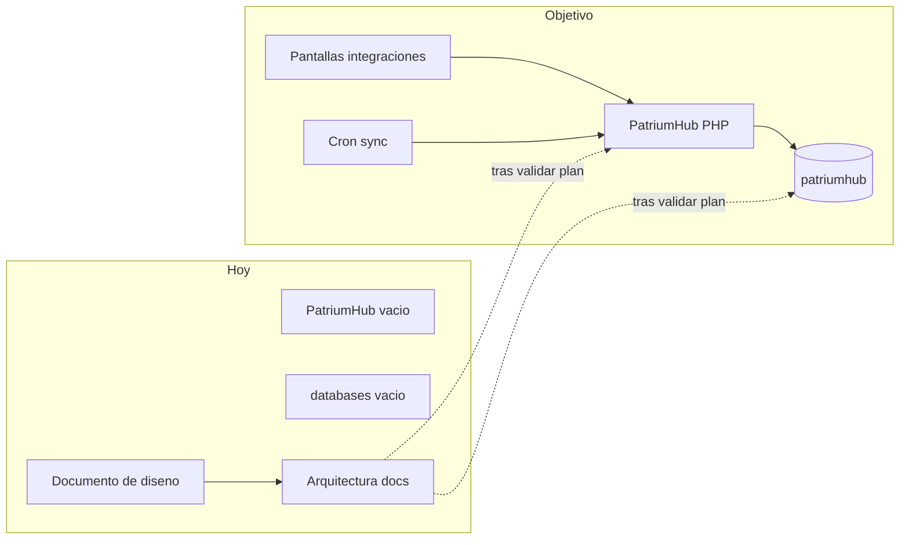

# 08 — Estado actual vs objetivo

## Resumen ejecutivo

Hoy existen los **repos vacíos** (`PatriumHub/`, `databases/`, `Arquitectura/`) y el **documento de diseño de producto** (v1).  
El objetivo es una app PHP monolítica + una BD MySQL desplegable en Apache/phpMyAdmin, con integraciones configurables desde pantallas.

| Tema | Hoy | Objetivo |
|------|-----|----------|
| Código app | README vacío en `PatriumHub/` | App PHP modular en `PatriumHub/` |
| BD | Repo `databases/` vacío | `patriumhub.sql` versionado |
| Docs arquitectura | Este set en progreso | Fuente de verdad de diseño |
| Deploy | No definido en código | Apache DocumentRoot + phpMyAdmin |
| Mercado Pago | Solo especificado en diseño | N cuentas desde UI, tokens en BD |
| WooCommerce | Solo especificado en diseño | N tiendas desde UI, keys en BD |
| `.env` para MP/WC | — | **No usar**; solo infra (`DB_*`, `APP_KEY`) |

## Diagrama gap

## Prioridad técnica sugerida (sin ejecutar aún)

1. Congelar docs de `Arquitectura/` ✅ (este set)
2. Crear schema `databases/patriumhub.sql`
3. Bootstrap PHP Apache (`public/`, auth, layout, config)
4. MVP patrimonio manual (entidades → elementos → dashboards)
5. Pantallas de integraciones + cifrado
6. Sync WooCommerce
7. Sync multi Mercado Pago
8. Participaciones / anti-duplicación avanzada / historial
