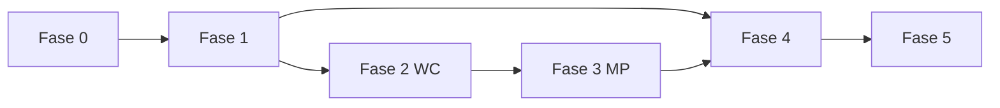

# Plan de trabajo PatriumHub

**Estado:** ✅ Fases 0–5 completas + post-MVP (presupuestos, estados/proyección)  
**Stack fijado:** PHP (front + back) · 1 BD MySQL (`patriumhub.sql` 0.7.0) · Apache · phpMyAdmin  
**Integraciones:** tokens solo en pantallas; cifrado vía Configuración (`storage/app.key`); `.env` = solo DB/URL

Este plan une:
1. El documento de diseño completo v1.
2. Las decisiones de deploy (Apache + una BD).
3. La misma lógica de fases usada en Puestito (docs → datos → MVP → integraciones).

---

## Objetivo del plan

Dejar PatriumHub operable como centro patrimonial: entidades, elementos manuales, dashboards, y conexiones WC/MP configurables desde la UI, con schema versionado en `databases/`.

---

## Fase 0 — Habilitación (arquitectura & datos) ✅

| ID | Entrega | Estado |
|----|---------|--------|
| F0.1 | Congelar docs de `Arquitectura/` | ✅ |
| F0.2 | `databases/patriumhub.sql` | ✅ |
| F0.3 | Apply phpMyAdmin documentado | ✅ |
| F0.4 | Config `DB_*` + `APP_KEY` | ✅ |
| F0.5 | Bootstrap Apache login/home | ✅ |

---

## Fase 1 — MVP patrimonio manual ✅

| ID | Entrega | Estado |
|----|---------|--------|
| F1.1–F1.11 | ABMs, patrimonio, dashboards, auditoría | ✅ |

---

## Fase 2 — Integraciones: infraestructura + WooCommerce ✅

| ID | Entrega | Estado |
|----|---------|--------|
| F2.1 | Módulo Integraciones: listado, alta, edición, revocar | ✅ |
| F2.2 | Cifrado `APP_KEY` + `integration_credentials` | ✅ |
| F2.3 | Pantalla WooCommerce (URL, key/secret, entidad, flags) | ✅ |
| F2.4 | Probar conexión + `sync_runs` | ✅ |
| F2.5 | Sync productos / stock → inventories + snapshots | ✅ |
| F2.6 | Sync pedidos / ventas → `sales_metrics` | ✅ |
| F2.7 | Cron `cron/sync.php` + sync manual UI | ✅ |
| F2.8 | Alertas dato desactualizado / error de auth | ✅ |

**Criterio de salida:** HomeSpot conecta su tienda desde la UI (sin `.env`) y ve stock/ventas en el dashboard de empresa.  
**Pendiente operativo:** probar contra una tienda WooCommerce real (consumer key/secret).

---

## Fase 3 — Mercado Pago multi-cuenta ✅

| ID | Entrega | Estado |
|----|---------|--------|
| F3.1 | Pantalla Mercado Pago (N cuentas, entidad + token en UI) | ✅ |
| F3.2 | Vincular/crear `account` tipo billetera por conexión | ✅ |
| F3.3 | Sync saldos (disponible / retenido) | ✅ |
| F3.4 | Sync pagos/movimientos importados | ✅ |
| F3.5 | Dashboard Mercado Pago consolidado + por cuenta | ✅ |
| F3.6 | Consolidación vía cuentas en patrimonio/dashboard | ✅ |
| F3.7 | Revocar sin perder histórico | ✅ |
| F3.8 | Sync comisiones (`fee_details`) como egresos | ✅ |
| — | Clave de cifrado en Configuración (no tokens en .env) | ✅ |

**Criterio de salida:** varias cuentas MP desde pantallas, dashboard MP usable, sin tokens en `.env`.

---

## Fase 4 — Participaciones, anti-duplicación e historial ✅

| ID | Entrega | Estado |
|----|---------|--------|
| F4.1 | Ownerships + valuaciones de empresa | ✅ |
| F4.2 | Patrimonio personal = personales + valor de participaciones (sin dobles) | ✅ |
| F4.3 | Patrimonio consolidado con eliminación de interacciones internas | ✅ |
| F4.4 | Historial de saldos / snapshots patrimoniales / evolución | ✅ |
| F4.5 | Deudas entre entidades internas (neto en consolidado) | ✅ |
| F4.6 | Guardar vistas de filtros frecuentes (opcional) | ✅ |

**Criterio de salida:** modo personal ≠ suma bruta de empresas; consolidado netea deudas internas; snapshots en dashboard + `cron/snapshots.php`.

---

## Fase 5 — Pulido UX, seguridad y operación ✅

| ID | Entrega | Estado |
|----|---------|--------|
| F5.1 | Skeleton loaders, empty states, chips de filtros | ✅ |
| F5.2 | Toggle ocultar cifras sensibles | ✅ |
| F5.3 | HTTPS checklist + hardening sesión | ✅ |
| F5.4 | Seeds demo | ✅ |
| F5.5 | Backup/restore documentado | ✅ |
| F5.6 | Exportación básica CSV | ✅ |

**Criterio de salida:** cifras ocultables, CSV usable, seed demo opcional, guía con HTTPS + backup/restore.

---

## Orden de ejecución

---

## Post-MVP ya en producto

| Entrega | Estado |
|---------|--------|
| Presupuestos mensuales + pasivo pendiente | ✅ |
| Estados y proyección (servicios / productos) | ✅ |
| Usuarios + permisos por entidad en Configuración | ✅ |
| Edición de movimientos con ajuste de saldos | ✅ |
| Borrado de cuentas en saldo 0 | ✅ |
| Nav móvil, ocultar cifras, CSV, snapshots entidad | ✅ |
| SQL instalación única schema 0.8.0 | ✅ |

## Próximo paso

1. Importar **solo** `databases/patriumhub.sql` en phpMyAdmin (ver [`../databases/README.md`](../databases/README.md))  
2. En servidor: **[guía de deploy](guia-deploy.md)**  
3. Uso diario + backups; roadmap de producto fuera del plan de fases MVP
