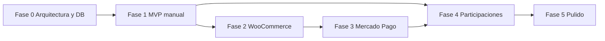

# Plan de trabajo PatriumHub

**Estado:** 📝 Propuesto — pendiente de validación  
**Stack fijado:** PHP (front + back) · 1 BD MySQL · Apache · phpMyAdmin  
**Integraciones:** credenciales por pantalla (no `.env` para MP/WC)

Este plan une:
1. El documento de diseño completo v1.
2. Las decisiones de deploy (Apache + una BD).
3. La misma lógica de fases usada en Puestito (docs → datos → MVP → integraciones).

---

## Objetivo del plan

Dejar PatriumHub operable como centro patrimonial: entidades, elementos manuales, dashboards, y conexiones WC/MP configurables desde la UI, con schema versionado en `databases/`.

---

## Fase 0 — Habilitación (arquitectura & datos)

> Bloqueante técnico. Sin código de dominio todavía (salvo bootstrap mínimo si se pide).

| ID | Entrega | Resultado |
|----|---------|-----------|
| F0.1 | Congelar docs de `Arquitectura/` (este set) | Fuente de verdad de diseño |
| F0.2 | Crear `databases/patriumhub.sql` con tablas núcleo + integraciones | Schema versionado |
| F0.3 | Documentar apply en phpMyAdmin + usuario MySQL de la app | Install reproducible |
| F0.4 | Definir `config` local: `DB_*` + `APP_KEY` (sin tokens MP/WC) | Infra alineada |
| F0.5 | Bootstrap Apache: `public/`, router mínimo, login stub | App arranca en blanco |

**Criterio de salida:** se puede importar la BD en phpMyAdmin y ver la app PHP sirviendo login/home vacío.

---

## Fase 1 — MVP patrimonio manual

> Equivale al “MVP” del roadmap del documento de diseño.

| ID | Entrega |
|----|---------|
| F1.1 | Auth sesión PHP (`users`) + layout base + navegación |
| F1.2 | ABM Entidades: Personas y Empresas |
| F1.3 | ABM Cuentas + saldo actual + flag “incluir en patrimonio” |
| F1.4 | ABM Activos y Propiedades (valuación + %) |
| F1.5 | ABM Cuentas por cobrar y Pasivos |
| F1.6 | Inventario manual (valor + unidades) |
| F1.7 | Movimientos básicos (ingreso/egreso/transferencia/ajuste) |
| F1.8 | Motor de cálculo de patrimonio por entidad |
| F1.9 | Dashboard general + filtros mínimos (entidad, moneda, período) |
| F1.10 | Dashboard por empresa (ficha con pestañas base) |
| F1.11 | Auditoría mínima de altas/ediciones |

**Criterio de salida:** se puede modelar el Caso 1 (patrimonio personal) y parte del Caso 2 (HomeSpot manual) sin integraciones.

---

## Fase 2 — Integraciones: infraestructura + WooCommerce

| ID | Entrega |
|----|---------|
| F2.1 | Módulo Integraciones: listado, alta, edición, revocar |
| F2.2 | Cifrado `APP_KEY` + tabla `integration_credentials` |
| F2.3 | Pantalla WooCommerce (URL, consumer key/secret, entidad, flags sync) |
| F2.4 | Probar conexión + `sync_runs` |
| F2.5 | Sync productos / stock → `inventories` + snapshots |
| F2.6 | Sync pedidos / ventas (agregados para dashboard empresa) |
| F2.7 | Cron `cron/sync.php` + sync manual desde UI |
| F2.8 | Alertas de dato desactualizado / error de auth |

**Criterio de salida:** HomeSpot conecta su tienda desde la UI (sin `.env`) y ve stock/ventas en el dashboard de empresa.

---

## Fase 3 — Mercado Pago multi-cuenta

| ID | Entrega |
|----|---------|
| F3.1 | Pantalla Mercado Pago (N cuentas, cada una con entidad + token) |
| F3.2 | Vincular/crear `account` tipo billetera por conexión |
| F3.3 | Sync saldos (disponible / retenido) |
| F3.4 | Sync movimientos, transferencias, comisiones, devoluciones |
| F3.5 | Dashboard Mercado Pago (consolidado + por cuenta) |
| F3.6 | Consolidación en dashboard general / filtro por entidad |
| F3.7 | Revocar conexión sin perder histórico |

**Criterio de salida:** Caso 3 — varias cuentas MP conectadas desde pantallas, saldos sin mezclar dueños.

---

## Fase 4 — Participaciones, anti-duplicación e historial

| ID | Entrega |
|----|---------|
| F4.1 | Ownerships + valuaciones de empresa |
| F4.2 | Patrimonio personal = personales + valor de participaciones (sin dobles) |
| F4.3 | Patrimonio consolidado con eliminación de interacciones internas |
| F4.4 | Historial de saldos / snapshots patrimoniales / evolución |
| F4.5 | Deudas entre entidades internas (neto en consolidado) |
| F4.6 | Guardar vistas de filtros frecuentes (opcional) |

**Criterio de salida:** Caso 1 y Caso 5 correctos; no se infla el patrimonio personal al abrir HomeSpot.

---

## Fase 5 — Pulido UX, seguridad y operación

| ID | Entrega |
|----|---------|
| F5.1 | Skeleton loaders, empty states, chips de filtros |
| F5.2 | Toggle ocultar cifras sensibles |
| F5.3 | HTTPS checklist + hardening sesión |
| F5.4 | Seeds demo (`databases/seeds/demo_minimo.sql`) |
| F5.5 | Backup/restore documentado |
| F5.6 | Exportación básica (CSV) de movimientos / patrimonio |

**Criterio de salida:** demo usable de punta a punta en Apache sin tocar SQL a mano para operar el día a día.

---

## Orden de ejecución propuesto

1. Fase 0  
2. Fase 1  
3. Fase 2 (WC)  
4. Fase 3 (MP) — puede solaparse parcialmente con F4 si el motor de patrimonio ya existe  
5. Fase 4  
6. Fase 5  

---

## Fuera de alcance de este plan (salvo que lo pidas)

- Contabilidad formal / AFIP / libros IVA  
- Laravel / React rewrite  
- Redis / colas / microservicios  
- API pública de PatriumHub  
- MFA, multi-usuario familiar con permisos finos  
- Mercado Libre, bancos open-banking, cripto, brokers  
- Docker como requisito (opcional más adelante)

---

## Checklist de validación (para vos)

Marcá OK / ajustar:

- [ ] ¿Confirmás **1 sola BD** `patriumhub` en `databases/`?
- [ ] ¿Confirmás **todo PHP** en `PatriumHub/` (front + back, sin SPA obligatoria)?
- [ ] ¿Confirmás que MP y WC se configuran **solo por pantallas** (tokens en BD cifrados)?
- [ ] ¿`.env`/config local solo para `DB_*` + `APP_KEY`?
- [ ] ¿Prioridad correcta: MVP manual (F1) → WC (F2) → MP (F3)?
- [ ] ¿Participaciones anti-duplicación entran en F4 (después del MVP) o querés algo mínimo ya en F1?
- [ ] ¿Ejecutamos solo Fase 0 primero, o F0+F1 juntas?

---

## Próximo paso

Respondé con:

1. `OK, ejecutá Fase 0`  
o  
2. `OK, ejecutá Fase 0 y Fase 1`  
o  
3. Ajustes puntuales al plan  

Hasta esa confirmación **no se implementa código ni SQL** en `PatriumHub/` / `databases/`.
